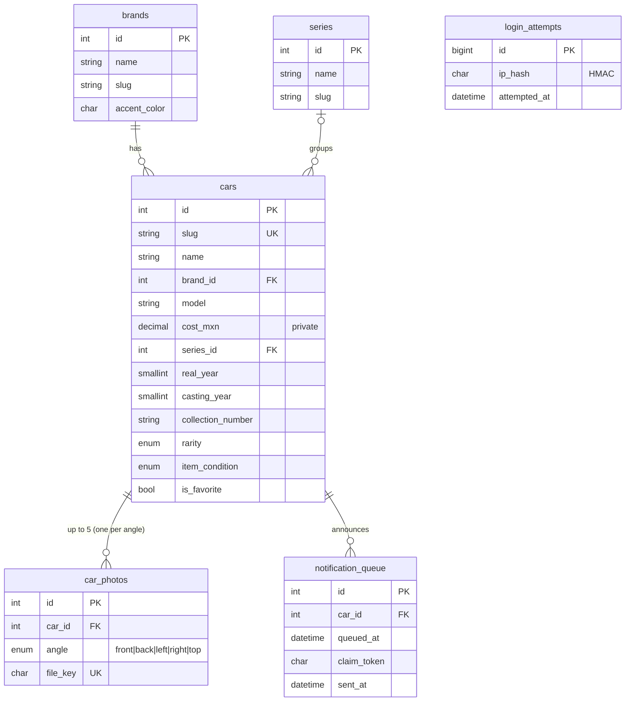

# GARAGE — by Samuel Torres

[](https://github.com/sammyrobin/garage/actions/workflows/deploy.yml)


A web app to catalogue and show off my die-cast car collection (Hot Wheels): a 3D intro,
a filterable gallery, a five-angle viewer per car, statistics, and a control panel that
anyone can explore in **exhibition mode**. It is plain PHP 8.3 + MySQL, built to run on
shared cPanel hosting with no Node, no SSH and no background workers.

**Live demo:** https://samueltorres.dev/garage · **Control panel:** https://samueltorres.dev/garage/admin


> 🇲🇽 **Resumen en español.** GARAGE es la app donde catalogo y exhibo mi colección de autos a
> escala. Tiene una intro 3D con fotos de mis autos, una galería con filtros combinables que
> se reflejan en la URL, un visor de 5 ángulos por auto, estadísticas y un panel de control
> público en modo exhibición: cualquiera puede explorarlo, pero solo el dueño puede guardar
> con su contraseña. Está hecha en PHP 8.3 puro con MySQL para hosting compartido. Las fotos se
> re-codifican a WebP sin metadatos EXIF ni GPS, y cada auto nuevo dispara un correo con el
> estado del disco. Se despliega sola por FTPS con GitHub Actions.

| Gallery | Car page | Quick-add form | Mobile |
|---|---|---|---|
|  |  |  |  |

<sub>Screenshots use local demo data with generated drawings instead of real photos.</sub>

## Features

- **3D intro.** Front photos of my cars float on a slowly spinning cylinder, with real depth and
  drag, touch and mouse control. Blurred red, yellow and blue blobs move behind them. On scroll
  or click, the cards fly into the grid (GSAP Flip). It plays once per session, is lighter on
  phones, and is skipped entirely for `prefers-reduced-motion`.
- **Gallery.** Combinable filters: brand chips, series, rarity, condition, year range, text and
  sort. They are all mirrored in the URL, so every view is shareable. Results update live and
  load with infinite scroll; without JS it is a plain GET form.
- **Car page.** A viewer for the angles that exist (front, back, left, right, top), with buttons,
  swipe, arrow keys and a "turn the car" transition. It also has a spec sheet and related cars.
- **Stats.** Totals, top brands chart, rarities, oldest car and Super Treasure Hunts.
  The total invested is private.
- **Exhibition-mode panel.** Anyone can browse it; saving needs the owner password, which opens
  a 30-minute session. Private costs show as `$ •••`. The quick-add form has name, brand + model,
  cost and five photo slots (click, drop or camera); the rest sits under "More details".
  **Save and add another** keeps the flow fast. Full CRUD covers cars, brands and series.
- **CSV import/export.** Import is all-or-nothing and reports errors per line. It accepts Spanish
  or English headers and comma or semicolon. Export is protected against formula injection.
- **New-car e-mail.** Includes the photo, totals and **server disk status**: the cPanel quota bar
  plus the space used by the Garage. Cars saved within 10 minutes are grouped into one summary.
- **Bilingual.** Spanish by default (`/garage/`), English under `/garage/en/`, with localized
  slugs, `hreflang` and a sitemap.

## Stack

| Layer | Choice |
|---|---|
| Backend | PHP 8.3, no framework: front controller, ~80-line router, PDO (prepared statements only) |
| Database | MySQL 8, numbered idempotent SQL migrations |
| Frontend | Server-rendered HTML, CSS custom properties, vanilla JS, GSAP 3 (ScrollTrigger + Flip), self-hosted |
| Images | GD: finfo check → re-encode → WebP 1600/800/400 px, EXIF/GPS stripped |
| Mail | Socket SMTP client (no Composer), HTML + text |
| Fonts | Big Shoulders Display, Outfit, JetBrains Mono (SIL OFL, woff2, self-hosted) |
| Hosting | GoDaddy cPanel shared hosting behind Cloudflare |
| CI/CD | GitHub Actions: `php -l` → config from Secrets → FTPS → migrations over HTTPS → health check |
| Local | Docker Compose: PHP 8.3 + Apache, MySQL 8, Mailpit |

## Architecture

```mermaid
flowchart LR
    V([Visitor]) -->|HTTPS| CF[Cloudflare]
    CF -->|HTTP, CF-Connecting-IP| AP[Apache · /garage/.htaccess]
    AP -->|static| ST[(assets/ · uploads/*.webp)]
    AP -->|everything else| FC[index.php]
    FC --> R{Router}
    R --> PUB[Public controllers<br/>gallery · car · stats · sitemap]
    R --> ADM[Admin controllers<br/>exhibition mode]
    R --> MIG[/_migrate<br/>token-protected/]
    ADM --> AUTH[Auth · CSRF · rate limit]
    ADM --> SVC[Services<br/>ImageProcessor · CsvService<br/>NotificationService · DiskStatus]
    PUB --> DB[(MySQL)]
    SVC --> DB
    SVC --> UP[(uploads/)]
    SVC -->|SMTP| MAIL[contacto@samueltorres.dev]
    SVC -->|UAPI Quota| CP[cPanel]
    GH[GitHub Actions] -->|FTPS| AP
    GH -->|POST X-Migrate-Token| MIG
```

```
index.php            Front controller
.htaccess            Self-contained rules for /garage (does not rely on the portfolio's)
app/Core/            Router, Request/Response, Database, Auth, Csrf, RateLimiter, ClientIp, Migrator…
app/Controllers/     Public, Admin, System (migrations)
app/Services/        ImageProcessor, PhotoStorage, CarService, Catalog, Stats, CsvService, Mailer…
app/Views/           Plain PHP templates (every value goes through e())
app/lang/            es.php, en.php
migrations/          001_…sql → 008_…sql
bin/                 CLI: migrate, set-password, notify (cron), build-config (deploy)
assets/              CSS, JS, fonts, GSAP
uploads/             Processed photos only (PHP disabled; not in git, never touched by deploys)
storage/             logs/ + cache/ (web-blocked)
```

## Data model



There is no `users` table. The single owner is represented by a `password_hash()` in the
generated config.

## Technical decisions

**Why plain PHP.** The host runs PHP and MySQL and nothing else: no Node, no SSH, no workers.
Without a framework, what I deploy is what runs. The app ships no `vendor/` and has no build
step, and every piece (router, migrations, SMTP, CSRF) is small enough to read in one sitting.
Composer was not necessary.

**Why CSS 3D + GSAP instead of Three.js.** The intro has to end with each card *becoming* a DOM
card in the grid. A WebGL canvas cannot FLIP into HTML elements, but DOM cards can. Each card is a
billboard (it always faces the camera) positioned with `translate3d` on a cylinder, and perspective
gives real depth. Opacity and blur fade the back row. GSAP is about 70 KB, against about 600 KB
for Three.js.

**How photos are processed.**
1. In the browser, a canvas resizes to 2000 px and re-encodes as JPEG. That saves bandwidth and
   already drops EXIF on the phone.
2. On the server, `finfo` checks the real type; the extension and the client MIME are ignored.
   GD decodes the image and applies the EXIF orientation.
3. The image is re-encoded from raw pixels. GD never copies metadata, so GPS, camera serials and
   thumbnails are gone.
4. Three WebP variants are written (1600/800/400 px at about 80% quality), plus a 240 px JPEG of
   the front photo for Outlook, which cannot show WebP.
5. File names are random 128-bit keys; the original is never stored.

A test feeds a JPEG with a real EXIF GPS block and asserts that none of it survives.

**Password before files.** In exhibition mode anyone can fill in the form, so the form first
sends the password alone (a small JSON request). Photos only leave the browser once the password
is accepted. Without JS, the server still checks rate limit → CSRF → password *before* calling
`finfo` or GD. PHP then discards the temporary uploads.

**Deploying to shared hosting.** GitHub Actions lints every file, then generates `app/config.php`
from Secrets. The admin password is stored only as a hash. SamKirkland/FTP-Deploy-Action then
syncs changed files over FTPS. `uploads/` and `storage/` are excluded, so a deploy can never
delete photos or logs; the protective `uploads/.htaccess` is reinstalled by the migration step
instead. With no SSH, migrations run through `POST /_migrate`, which answers 404 without the right
`X-Migrate-Token`. A health check then requests the live pages. The very first run is a dry run.
The deploy is isolated from the portfolio's own deploy: it uses a separate FTP account rooted at
`public_html/garage`, with its own sync state.

**E-mails without cron coupling.** "Save" sends one summary with everything pending; "Save and add
another" only queues. If the tab is closed, whatever is left is sent once 10 minutes pass without
new cars, by a cPanel cron (`bin/notify.php`) or lazily by the next admin page view. An atomic claim
token prevents double sends. SMTP runs after the response is flushed, and a failed e-mail never
blocks saving.

**Disk status.** It comes from cPanel UAPI `Quota::get_quota_info` with an API token that lives
only on the server, cached for 10 minutes. `disk_free_space()` would report the whole shared
server's disk, not my quota. The size of `uploads/` is computed in PHP and cached hourly.

## Security

- All HTML output goes through `e()` (`htmlspecialchars`, `ENT_QUOTES`), and all SQL uses PDO
  prepared statements with emulation off. Dynamic column lists come only from whitelists.
- A CSRF token guards every form. The session cookie is `Secure` + `HttpOnly` + `SameSite=Lax`,
  its ID is regenerated on unlock, and it expires after 30 minutes of inactivity.
- The owner password is limited to **5 failed attempts per real IP every 15 minutes**. The real IP
  is `CF-Connecting-IP`, trusted only when `REMOTE_ADDR` is inside Cloudflare's published IPv4/IPv6
  ranges. IPs are stored as an HMAC and logged masked.
- Headers: a strict CSP (`script-src 'self'`, `style-src 'self'`, no inline code: brand colors come
  from a generated stylesheet), plus `X-Frame-Options: DENY`, `nosniff` and `Referrer-Policy`.
- `app/`, `migrations/`, `storage/`, `bin/`, dotfiles, `*.sql`, `*.md` and config are denied by
  `.htaccess`. `uploads/` has the PHP engine off and serves only `.webp`/`.jpg`.
- Private data is filtered server-side. Cost columns are never selected for public pages, and
  without an owner session the panel receives `null`, not a hidden value.
- Production errors are logged in `storage/logs` and visitors see a generic page.

## Run it locally

Requirements: Docker Desktop.

```bash
git clone https://github.com/sammyrobin/garage.git && cd garage
cp app/config.example.php app/config.php          # set db.pass to "garage_local"
docker compose up -d --build
docker compose exec app php bin/migrate.php        # tables, seeds, uploads/.htaccess
docker compose exec app php bin/set-password.php   # owner password (typed hidden)
```

- App: http://localhost:8090/garage/ (English: `/garage/en/`, panel: `/garage/admin`)
- Mailpit (catches every e-mail): http://localhost:8025

For local mail, set `mail.host` to `mail`, port `1025`, `secure` to `''` and an empty username.
The port can be changed with `GARAGE_PORT=8081 docker compose up -d`.

## Deploy setup

1. Repository **Secrets**: `FTP_SERVER`, `FTP_USERNAME`, `FTP_PASSWORD`, `DB_NAME`, `DB_USER`,
   `DB_PASS`, `ADMIN_EMAIL`, `ADMIN_PASSWORD`, `MIGRATE_TOKEN`, `APP_KEY`, `SMTP_PASSWORD`,
   `CPANEL_HOST`, `CPANEL_USER`, `CPANEL_API_TOKEN`.
2. The workflow runs as a **dry run** until the repository **variable** `DRY_RUN` is set to `false`.
3. cPanel → Cron Jobs, every 5 minutes: `/usr/local/bin/php /home/<user>/public_html/garage/bin/notify.php`

## Roadmap

- [ ] Wishlist of castings I am still hunting
- [ ] Duplicate detection when adding a car (name + series + year)
- [ ] Barcode scan from the blister to prefill the form
- [ ] Public JSON feed of the collection
- [ ] Automated PHPUnit suite in CI (today: end-to-end scripts run locally)

## License

Code under the [MIT License](LICENSE). Photos are not covered. GSAP is used under its own
[standard license](https://gsap.com/standard-license); the fonts are under the SIL OFL.
Hot Wheels is a trademark of Mattel, and car brands are trademarks of their owners. They appear
only as descriptive text; this project is not affiliated with any of them.
